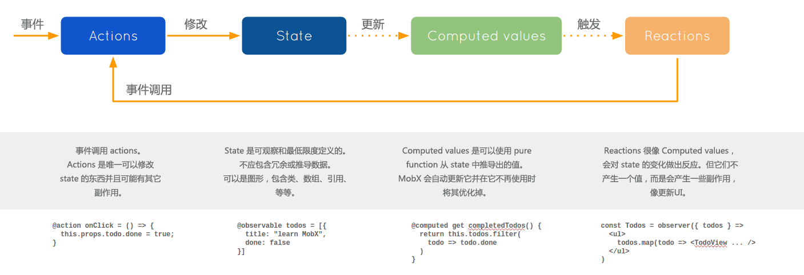

# MobX 学习笔记
## 什么是 MobX？
MobX 是简单、可拓展状态管理，类似于 Redux。但是 MobX 的特点在于：函数响应式编程（TFRP）。（关于函数式编程结尾列出相关资料，可做进一步阅读）
>任何源自应用状态的东西都应该自动获得。包括 UI、数据序列化、服务器通讯等。

MobX 只做一件事，就是解决 state 到 view 的数据更新问题。

## MobX 核心概念
MobX 核心概念不多，就只有下面几个：
### State(状态)
**状态** 是驱动应用的数据
### Derivations（衍生）
任何源自 State 而没有任何进一步交互的东西就是衍生。衍生的形式可以是下面：
* UI 界面
* 衍生数据
* 后端集成

MobX 区分了两种衍生的类型：
* computed values(计算值)
* Reactions(反应)

### Actions（动作）
在 严格模式下，所有的动作改变状态都应该通过 `@action` 来定义。action 可以是用户事件、后端数据推送、预订事件等等。

## 拓展阅读
* [《JavaScript函数式编程》](https://book.douban.com/subject/26579320/)
* [JS函数式编程指南](http://t.cn/RyZdymZ)
* [MobX 高效响应](http://t.cn/RoSl1oO)
* [Building a performant Stopwatch with MobX and React](http://t.cn/R5KszrG)
